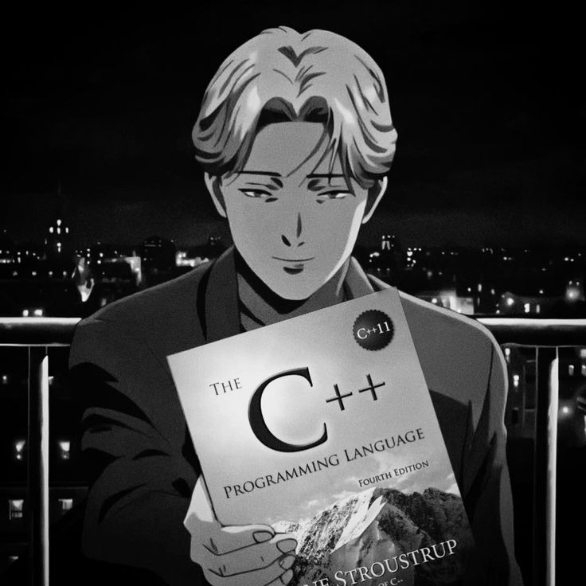
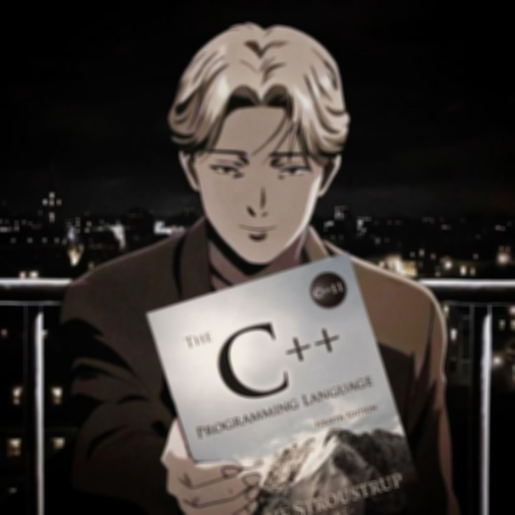
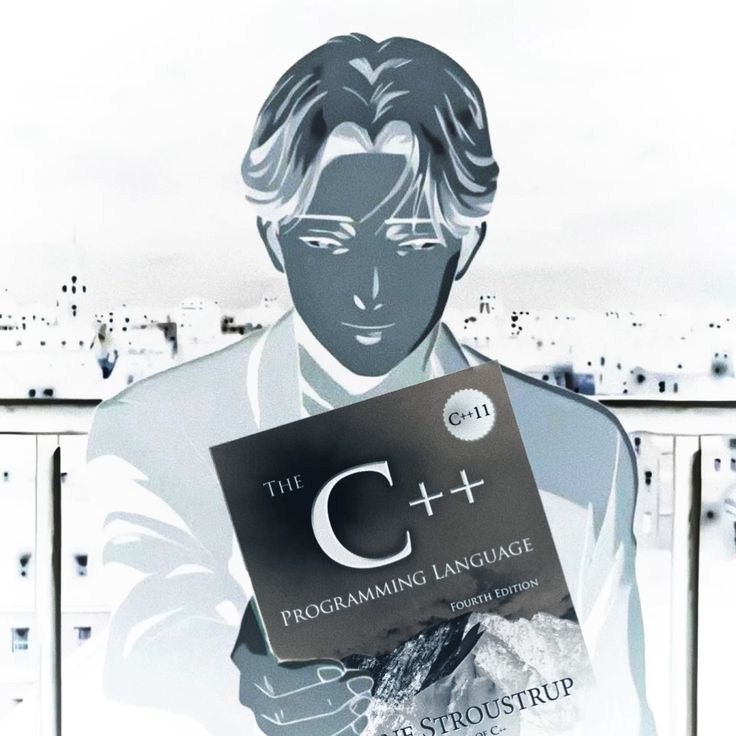
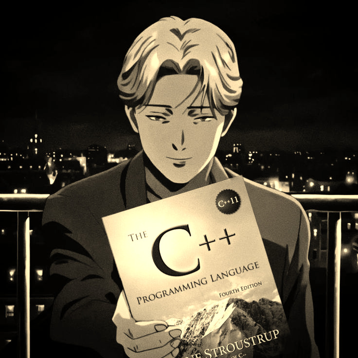

# neon-kernel

GPU-accelerated image processing for PPM files using CUDA.

## Requirements

- NVIDIA GPU with CUDA support
- CUDA Toolkit
- CMake 4.0+
- C++23 compatible compiler

## Build

```bash
python scripts/build.py --build-type release
```

## Usage

```bash
python scripts/run.py --build-type release -i input.ppm -o output.ppm -e effect -v value
```

### Arguments

| Argument | Description |
|----------|-------------|
| `-i, --input` | Input PPM file (required) |
| `-o, --output` | Output PPM file (default: `output.ppm`) |
| `-e, --effect` | Effect to apply (required) |
| `-v, --value` | Effect parameter (for blur: radius) |

### Effects

| Effect | Description |
|--------|-------------|
| `grayscale` | Converts image to grayscale using ITU-R BT.601 |
| `blur` | Box blur with configurable radius |
| `inversion` | Inverts RGB channels |
| `sepia` | Applies sepia tone |

## Gallery

<div>
<p><b>Original</b></p>

</div>

| Grayscale | Blur |
|:---------:|:----:|
|  |  |

| Inversion | Sepia |
|:---------:|:-----:|
|  |  |

## Examples

```bash
# Grayscale
python scripts/run.py --build-type release -i photo.ppm -o gray.ppm -e grayscale

# Blur with radius 5
python scripts/run.py --build-type release -i photo.ppm -o blurred.ppm -e blur -v 5

# Invert colors
python scripts/run.py --build-type release -i photo.ppm -o inverted.ppm -e inversion

# Sepia tone
python scripts/run.py --build-type release -i photo.ppm -o sepia.ppm -e sepia
```

## Supported Formats

PPM (Portable Pixmap):
- P3 (ASCII)
- P6 (Binary, 8-bit and 16-bit)

## License

See [LICENSE](LICENSE) file.
